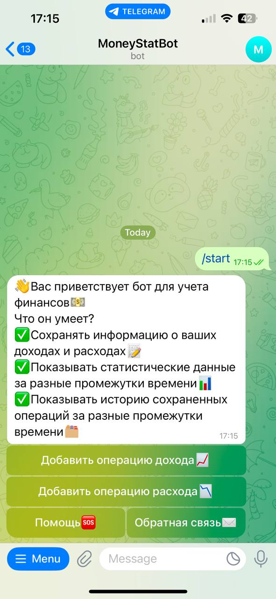
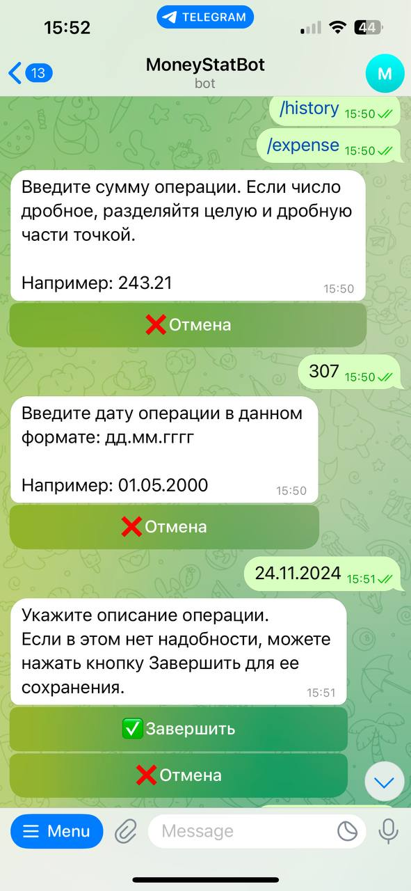
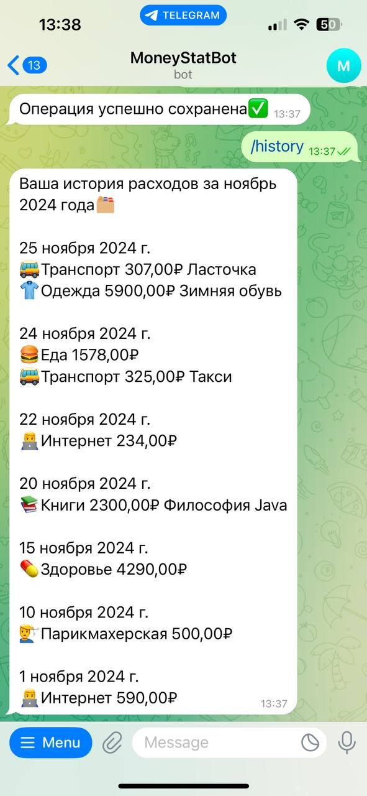

# MoneyStatBot
Telegram-бот для учета финансов. Он может сохранять информацию о денежных расходах и доходах, показывать историю операций и статистику за разные периоды.
### Стек технологий
* Java 22
* Spring Boot
* Spring MVC
* Spring Data
* PostgreSQL
* Lombok
* Telegram API

### Скриншоты с примерами работы бота

  
  

  
  

  
  

